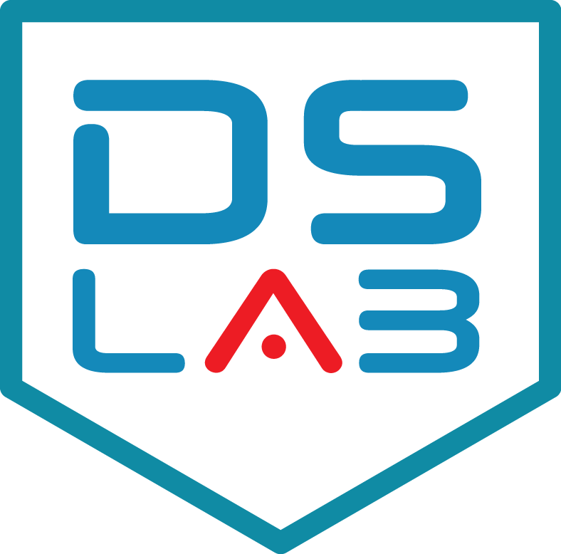

<h2>Wellcome to the Data Explorer Assistant!</h2>

        

In an era defined by the relentless surge of information, the ability to navigate and extract insights from data has become paramount. Enter "Data Explorer Assistant," your trusted ally in the quest to unlock the full potential of data. Whether you're a seasoned data scientist, a business analyst, or simply curious about the stories hidden within the numbers, this innovative app is designed to empower you with the tools and guidance you need to explore, analyze, and visualize your data like never before.

 

Data Explorer Assistant is a comprehensive data exploration and analysis platform that seamlessly combines cutting-edge technology with user-friendly features, making data manipulation a breeze for both experts and novices. Whether you're dealing with complex datasets, spreadsheets, databases, or any other data source, this app serves as your all-in-one companion in the world of data analytics.

    

